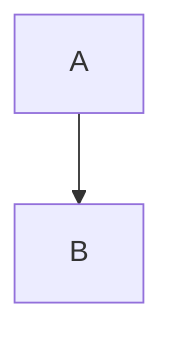

This is to test that questions requiring scripts like mermaid, prism or
mathjax are working.



```java
public static void main(String[] cheese){}
```

```
This should not be highlighted
```

$$ e = mc^2 $$

\(e = mc^2\)

---Answers
a
---
b
---
c